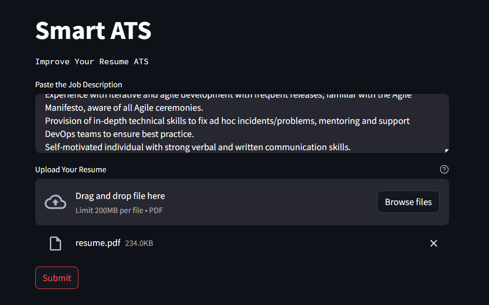
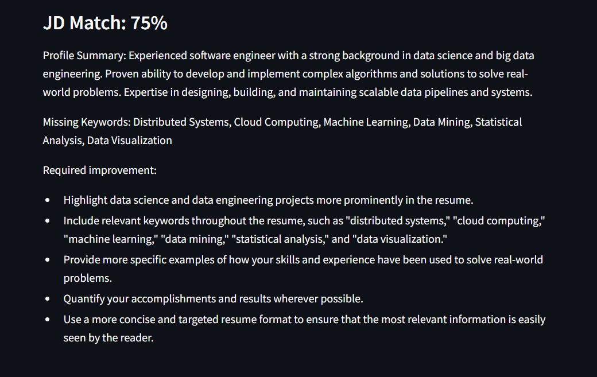

# Smart ATS App

This is a Streamlit web application that uses the Google Generative AI to evaluate resumes based on a given job description. It acts like a skilled or very experienced ATS (Application Tracking System) with a deep understanding of the tech field, software engineering, data science, data analyst, and big data engineering. It provides the best assistance for improving resumes by assigning a percentage match based on the job description and identifying the missing keywords with high accuracy.

## Demo

Here is a demo of the application:

<p align="center">
  
  
</p>

## Installation

1. Clone the repository to your local machine.
2. Install the required packages:

```
pip install -r requirements.txt
```

## Usage

1. Set up your environment variables in a .env file with your Google API Key:

```
GOOGLE_API_KEY=your_google_api_key
```

2. Run the Streamlit app:

```
streamlit run app.py
```

## Features

- Paste the job description.
- Upload your resume in PDF format.
- Get the percentage match based on the job description.
- Get the missing keywords in your resume.
- Get advice to make your resume aligned with the current job description.

## Contributing

Pull requests are welcome. For major changes, please open an issue first to discuss what you would like to change.

## License

The MultiPDF Chat App is released under the [MIT License](https://opensource.org/licenses/MIT).
