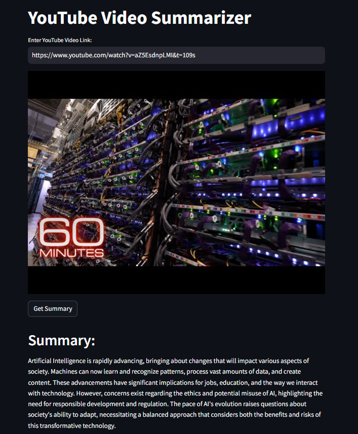

# YouTube Video Summarizer

This is a Streamlit web application that uses the Google Generative AI to summarize YouTube videos. It extracts the transcript of a given YouTube video and generates a summary of the video content.

## Demo

Here is a demo of the application:

<p align="center">
  
</p>

## Installation

1. Clone the repository to your local machine.
2. Install the required packages:

```
pip install -r requirements.txt
```

## Usage

1. Set up your environment variables in a .env file with your Google API Key:

```
GOOGLE_API_KEY=your_google_api_key
```

2. Run the Streamlit app:

```
streamlit run app.py
```

## Features

- Enter the YouTube video link.
- Get the summary of the video content.

## Contributing

Pull requests are welcome. For major changes, please open an issue first to discuss what you would like to change.

## License

The MultiPDF Chat App is released under the [MIT License](https://opensource.org/licenses/MIT).
