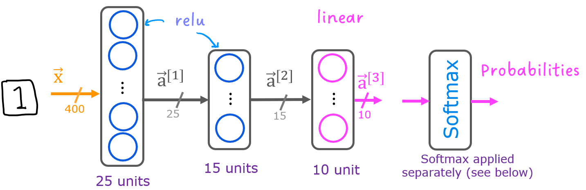
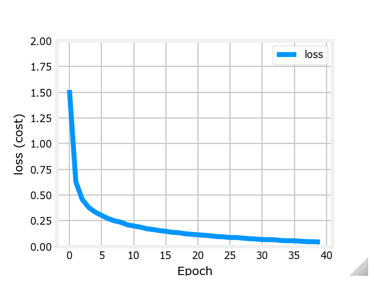

# Handwritten Digit Recognition

This project is a machine learning and deep learning-based approach for recognizing handwritten digits. It uses numpy data files for storing the digit images and their labels, and a Jupyter notebook for implementing the TensorFlow model. The project also includes a matplotlib style file for consistent visualization styles across different plots.

## Project Structure

The project has the following structure:

```
data/ X.npy y.npy deeplearning.mplstyle main.ipynb utils.py pycache/
```

## Data

The data for this project is stored in numpy files in the `data/` directory.

- `X.npy`: This file contains the input data for the project.
- `y.npy`: This file contains the output data for the project.

### Data Images


## Model

Description of the model.



```python
model = Sequential(
    [               
        tf.keras.layers.InputLayer((400,)),
        tf.keras.layers.Dense(25, activation="relu", name="L1"),
        tf.keras.layers.Dense(15, activation="relu", name="L2"),
        tf.keras.layers.Dense(10, activation="linear", name="L3")
    ], name = "my_model" 
)

model.compile(
    loss=tf.keras.losses.SparseCategoricalCrossentropy(from_logits=True),
    optimizer=tf.keras.optimizers.Adam(learning_rate=0.001),
)

history = model.fit(
    X,y,
    epochs=40
)
```

## Loss

Description of the loss.



## Scripts

- `main.ipynb`: This is the main Jupyter notebook for the project. It contains the main deep learning model and the code to train and test the model.
- `utils.py`: This script contains utility functions used in the project. These functions are used for data preprocessing and visualization.

## Style

The `deeplearning.mplstyle` file contains matplotlib styles for the project. These styles are used for all the plots in the project.

## Getting Started

To get started with this project:

1. Clone the repository: `https://github.com/apurbar06/ML_DL_things.git`
2. Move to directory: `cd .\handwritten_digit_recognition_ml\`
3. Install the required dependencies: `pip install <package_name>`
4. Run the `main.ipynb`

## Dependencies

This project requires the following dependencies:

- numpy
- pandas
- matplotlib
- scikit-learn
- tensorflow

## License

This project is licensed under the MIT License - see the [LICENSE](https://github.com/git/git-scm.com/blob/main/MIT-LICENSE.txt) file for details.
