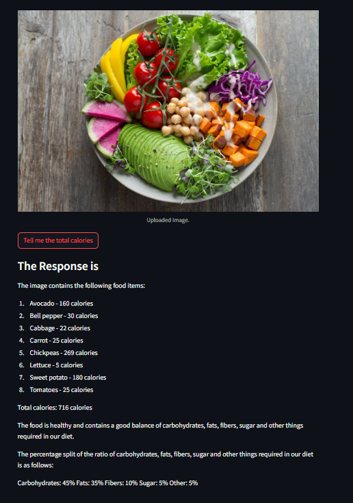

# Gemini Health App

This is a Streamlit web application that uses the Google Gemini Pro Vision API to analyze food items from an uploaded image and calculate their total calorie content. It also provides details of every food item with calorie intake and assesses whether the food is healthy or not. It also provides the percentage split of the ratio of carbohydrates, fats, fibers, sugar, and other things required in our diet.


## Demo

Here is a demo of the application:

<p align="center">
  
</p>


## Installation

1. Clone the repository to your local machine.
2. Install the required packages:

```
pip install -r requirements.txt
```

## Usage

1. Set up your environment variables in a .env file with your Google API Key:

```
GOOGLE_API_KEY=your_google_api_key
```

2. Run the Streamlit app:

```
streamlit run app.py
```

## Features

- Upload an image of food items.
- Get the total calorie content of the food items in the image.
- Get the details of every food item with calorie intake.
- Get an assessment of whether the food is healthy or not.
- Get the percentage split of the ratio of carbohydrates, fats, fibers, sugar, and other things required in our diet.

## Contributing

Pull requests are welcome. For major changes, please open an issue first to discuss what you would like to change.

## License

The MultiPDF Chat App is released under the [MIT License](https://opensource.org/licenses/MIT).
